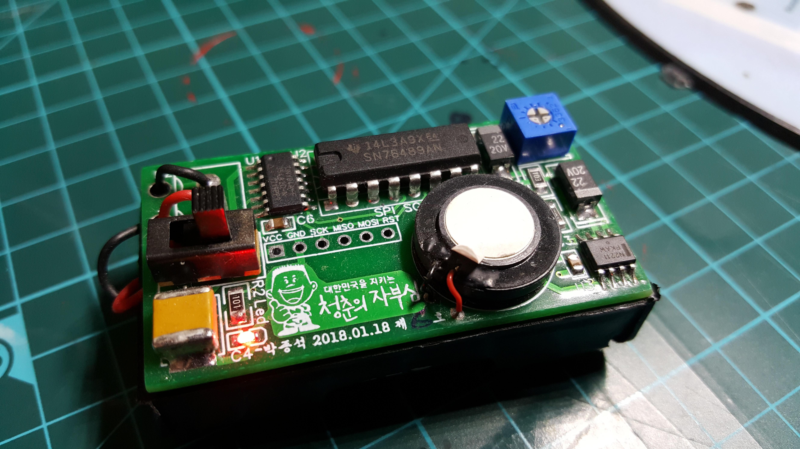

3 Track MIDI player using SN76489 & Attiny84a.
2018. 1. 23.

Software, schemetic, PCB file created by PARK JONG SEOK (박종석)

Schemetic & PCB link : https://easyeda.com/cakeng/SN76489_Buzzer-ccec70a336364834b7111a98d326e243

NO LICENCE INCLUDED

Contact cakeng@naver.com to
use, modify, or share the software, schemetic, PCB for any purpose
other than personal use.

Sheet file format:

Each note is composed of 6 duration bits, 7 tone bits, and 3 volume bits.
ex) 0b0001000001111101 -> Duration: 4 ticks, Tone: 15, Volume: 5/8

Each sheet corresponds to each channel of SN76489.

Given sheet file is for Yukinohana.

Demonstration video Links:

